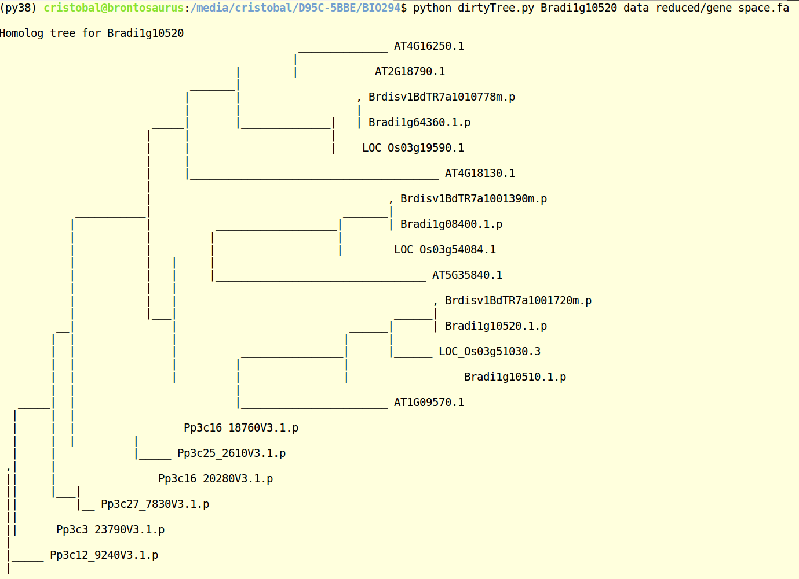

# Course material for bio294

# BIO294: bioinformatics for comparative and evolutionary genomics
christoph.stritt@botinst.uzh.ch  
*14 November 2019*

# First steps to building your own bioinformatics toolbox with Python

#### Online documentation
https://www.python.org/doc/  
https://biopython.org/  
http://rosalind.info/problems/locations/

## A simple program to explore gene trees 
### Phytochrome A

